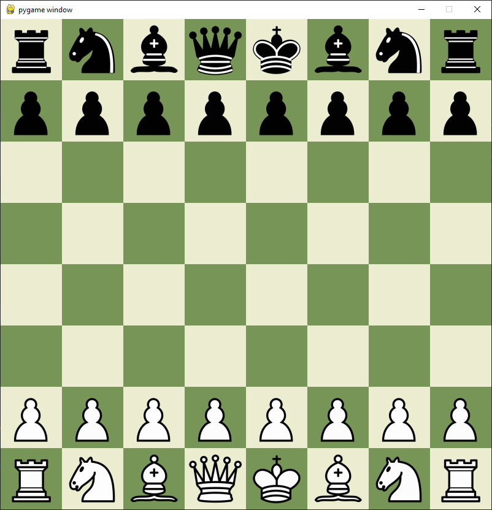
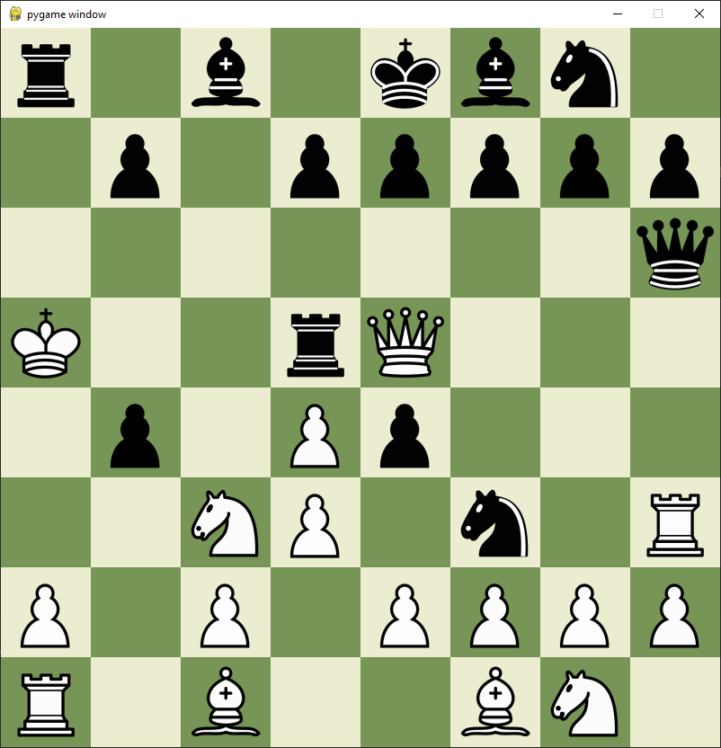
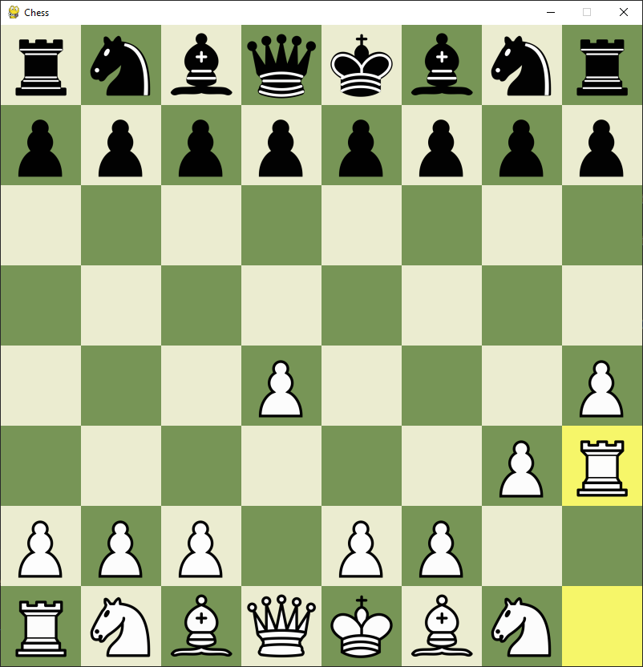

# Chess
Simple chess game using the PyGame library

# Created a basic chess board with visible pieces in their correct position.

# Pieces can move freely around the board

# Pieces can now only move to certain locations on the board, indicated by the game using circles
